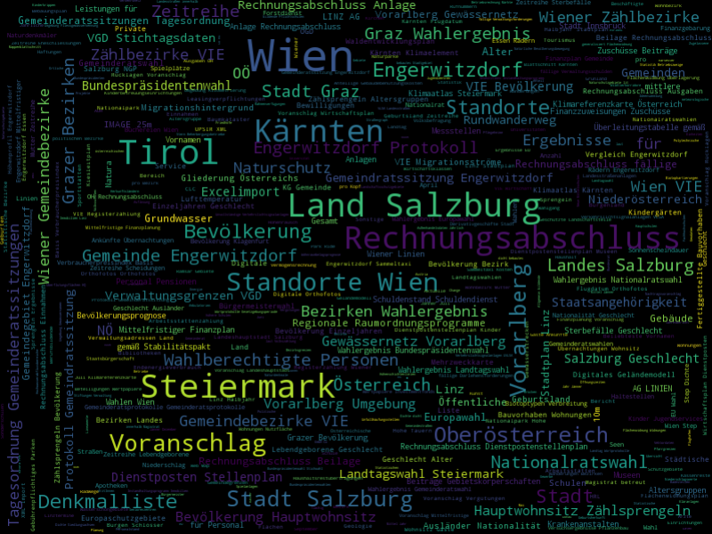
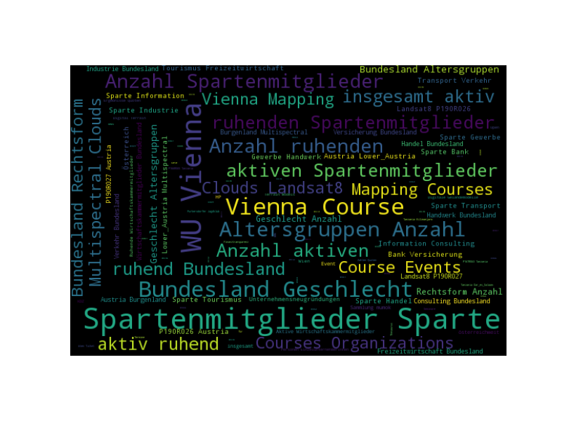

# CommuniData project
Public repository of the research project CommuniData: Open Data for Local Communities http://www.communidata.at

## Prerequisites

* [wordcloud](https://github.com/amueller/word_cloud)
* Pillow

## Results

* titles from all 2297 datasets in data_gv_at portal, 373 datasets in www_opendataportal_at portal (latest snapshot: 1st week of 2017 '1701')
* Exception from the API: {u'message': u'QueuePool limit of size 20 overflow 10 reached, connection timed out, timeout 30'} after ~150 requests (data_gv_at: 1643 snapshot)

#### data.gv.at Wordcloud (2297 datasets as of 31.12.2016)

#### opendataportal.at Wordcloud (373 datasets as of 31.12.2016)

## License

This project is licensed under the MIT License

## Acknowledgments

* Austrian Research Promotion Agency (FFG)
* Sebastian Neumaier: Open Data Portal Watch API http://data.wu.ac.at/portalwatch/

## Related work

* Los Angeles GeoHub
http://geohub.lacity.org
https://www.youtube.com/watch?v=iuUShx8hsWQ
