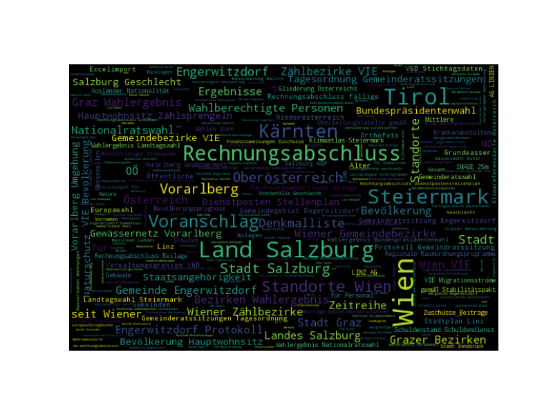

# CommuniData project
Public repository of the research project CommuniData: Open Data for Local Communities http://www.communidata.at

## Prerequisites

* [wordcloud](https://github.com/amueller/word_cloud)
* Pillow

## Results

* 2219 datasets in data_gv_at portal (snapshot='1643')
* 2204 titles retrieved
* Exception: {u'message': u'QueuePool limit of size 20 overflow 10 reached, connection timed out, timeout 30'}

## License

This project is licensed under the MIT License

## Acknowledgments

* Austrian Research Promotion Agency (FFG)
* Sebastian Neumaier: Open Data Portal Watch API http://data.wu.ac.at/portalwatch/

## Related work

* Los Angeles GeoHub
http://geohub.lacity.org
https://www.youtube.com/watch?v=iuUShx8hsWQ
